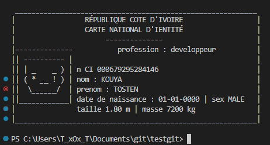

# **Carte d'Identité**
Qu'est-ce qu'une **Carte d'Identité** ? Vous le savez sûrement, une **carte d'identité** est un **Objet** qui regroupe plusieurs de nos informations personnelles telles que **nom**, **prénom**, **date de naissance** et j'en passe, mais le plus important sur une **Carte d'Identité** c'est la **photo** grâce à notre **Intelligence Artificielle (IA)** qui vous génère **un avartar Authentique** en tenant compte de vos informations personnelles cependant le sexe influence beaucoup à la conception.

## **Prérequis**
+ `Pyhon`
- `module`<br>
    > tout les **`modules`** utilisés actuellement sont natifs à `python`

### **Exemle de Carte d'Identité génerer par l'IA**
   

### Teste l'**IA**
```
git clone https://github.com/Tostenn/py-Carte-Id.git
cd py-Carte-Id
python main.py

```

## **Avenir**
+ passage des parametres à l'<b style="text-transform:uppercase;">(ia)</b> pour éviter de les renter en dûr dans le programme 

    ```
    python main.py --nom kouassi --prenom marie --pays --...
    ```

- enregistrer la sortie dans un fichier **texte**

    ```
    python main.py -s || --save path
    ```

+ fournir du **json** ou du **texte** pour évider de rentrer les parametres `--nom ...`

    ```
    python main.py -d || --data path
    ```
    + format **json**
    
    ```
    {
        "nom":"angela",
        "prenom":"merkel",
        "dtn":"17-07-1954",
        "sex":"F",
        "taille":1.65,
        "masse":65,
        "pays":"USA",
        "job":"femme d'Etat"
    }
    ```
    - format **texte**
    ```
    nom:jul
    prenom:céssar       
    dtn:12-07-100    
    sex:M
    taille:1.8        
    masse:93
    pays:France
    job:empreur
    ```

- introduire et gérer un fichier de configuration **json** 

    ```
    python main.py config ...
    ```

## **Commencer a travail sur le depôt**
```
git clone https://github.com/Tostenn/py-Carte-Id.git
echo voir l'histoireique des commits
cd py-Carte-Id
git log --oneline
```

## **Avis aux Developpeurs**
> tout **Developpeur** désireux de participer ou emettre des suggestions peut nous rejoindre sur telegram [**Carte d'Identité en python**](https://t.me/+n9v9xfVaR38xNmM0) quelque soit votre niveau de developpeur vous serez le ou la bienvenue.

# **Ce Depot**
> **__Toute amélioration sera la  `BIENVENUE`__** <br>
> **email `kouyatosten@gmail.com`** <br>
> **Statut :  `En Cours`**
