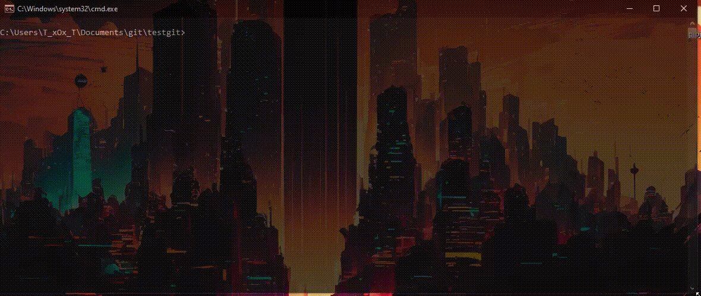
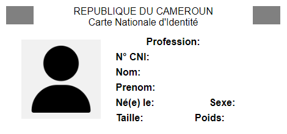
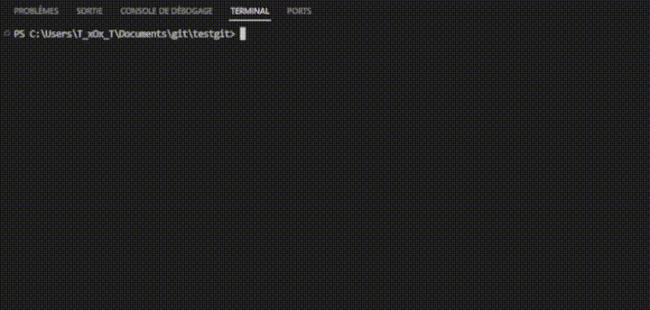
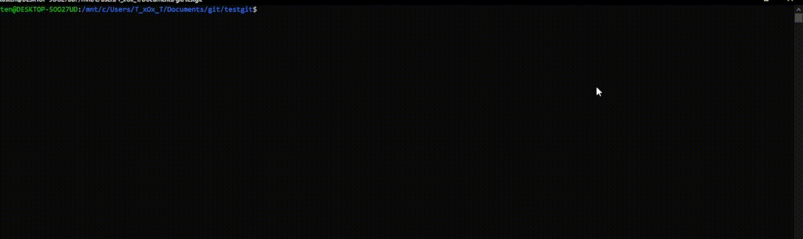

# **Carte d'Identité**
Qu'est-ce qu'une **Carte d'Identité** ? Vous le savez sûrement, une **carte d'identité** est un **Objet** qui regroupe plusieurs de nos informations personnelles telles que **nom**, **prénom**, **date de naissance** et j'en passe, mais le plus important sur une **Carte d'Identité** c'est la **photo** grâce à notre **Intelligence Artificielle (IA)** capable de vous générer **un avartar Authentique** en tenant compte de vos informations personnelles. Cependant le caractère  **sexe** influence beaucoup à la conception .
<hr>

### <b style="text-transform:capitalize;"> bon  à savoir</b>
Ce README est en constante évolution, alors jetez-y un coup d'œil plus complet de temps en temps... Vous trouverez peut-être de nouveaux détails intéressants dans d'autres sections ! 😊

## **Prérequis**
+ `Pyhon`

    > version __>= 3__
- `module`

    >`opencv-python` version __4.8.1.78__<br>
    `Pillow` version __10.0.0__
    
### **Exemle de Carte d'Identité génerer par l'IA**
   

### Test l'**IA**
```
git clone https://github.com/Tostenn/py-Carte-Id.git
cd py-Carte-Id
pip install -r requirement.txt
python main.py

```

## Nouveauté
### Sauvegarde avec un fichier Texte


### Sauvegarde avec un fichier imge png


Désormais possible d'enregister la Carte ID au foramt **Png** ou **Texte**,
cette option peut être associer au différent mode pour une meilleur expérience visuel avec l'**IA**.<br>
<br>
Pour utiliser, trés simple
```
    python main.py -d chemin/*.txt --save myCarte.png
    python main.py --data-path chemin/*.json -s myCarte
```

>remaque : L'enregistrement au format image sera formater à partir de ce template <br>
</img>
    
## **Mode Interactif**


Le **Mode iteractif** permet aux utilisateurs d'interagir  avec l'**IA** qui vérifie le traitement de vos données tout en vous indiquant les erreurs potentielles suceptibles d'être commise . Vous êtes guidés dans ses interventions par des informations visualisées grâce l'**IA**.<br>

paramètre d'utilisation du le **mode interactif**<br>
+ interation avec la console `-i console`
- interation via une interface graphique `-i interface` (pas encore disponible)
+ descativation `-i descative` état par defaut

## **Mode data parse**


Le mode <b style="text-transform:uppercase;" > data parse </b> vous permet d'envoyer le contenu d'un fichier a l'**IA** qui utilisera les données du fichier pour confectionner une nouvelle **carte ID**. l'**IA** détecte automatiquement les données mal fournir et vous le signal avec des messages précis

paramètre d'utilisation du  **mode data parse**<br>
+ json `-d data.json`<br>
- texte `--data-path /data/carte.txt` etat par defaut
+ format accéptable du **json** ou du **texte** pour évider de rentrer les parametres `--nom ...`

    ```
    python main.py -d || --data path
    ```
    + format **json**
    
    ```
    {
        "nom":"angela",
        "prenom":"merkel",
        "dtn":"17-07-1954",
        "sex":"F",
        "taille":1.65,
        "poid":65,
        "pays":"USA",
        "job":"femme d'Etat"
    }
    ```
    - format **texte**
    ```
    nom:jul
    prenom:céssar       
    dtn:12-07-100    
    sex:M
    taille:1.8        
    poid:93
    pays:France
    job:empreur
    ```
    >`remarque` : l'ordre de disposition des key:value ne sont pas important

## Sauvegarde d'une Carte ID
aprés avoir génerer votre **Carte ID**, sa serait cool de pouvoir l'enregistrer, se rêve est possible avec l'option `-s` ou `--save` qui permet d'enregistrer votre travail au format souhaiter. vous pouvez la combiner avec tout les mode de géneration de carte sans aucun probleme

paramètre d'utilisation pour bien enregistrer votre travail<br>
`-s` nomfichier.[`png` || `txt`] fourni un de fichier suivi du foramt dans lequel vous souhaitez sauvegarder 
> vous pouvez indiquer un de fichier sans extension pour enregistrer au format texte
```
    python main.py -i active -s Carte-ID.png
```

## **À venir**
+ passage des parametres à l'<b style="text-transform:uppercase;">(ia)</b> pour éviter de les renter en dûr dans le programme 

    ```
    python main.py --nom kouassi --prenom marie --pays --...
    ```

+ mode Interactif avec une interface graphique
    ```
    python main.py -i interface
    ```


- introduire et gérer un fichier de configuration **json** 

    ```
    python main.py config ...
    ```
- Ajouter un affichage sous forme d'image
!
## **Commencer a travail sur le depôt**
```
git clone https://github.com/Tostenn/py-Carte-Id.git
echo voir l'historique des commits
cd py-Carte-Id
pip install -r requirement.txt
git log --oneline
```

## **Avis aux Developpeurs**
>tout **Developpeur** désireux de participer ou emettre des suggestions peut nous rejoindre sur telegram [**Carte d'Identité en python**](https://t.me/+n9v9xfVaR38xNmM0) quelque soit votre niveau de developpeur vous serez le ou la bienvenue.

# **Ce Depot**
> **__Toute amélioration sera la  `BIENVENUE`__** <br>
> **email `kouyatosten@gmail.com`** <br>
> **Statut  `En Cours`**