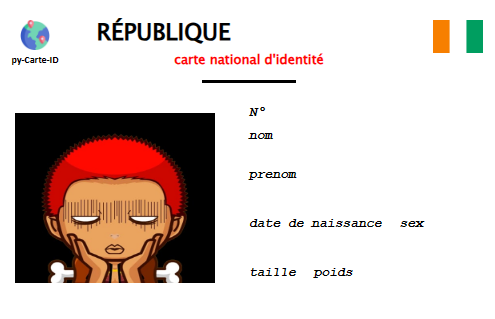

# <b style="text-transform:uppercase;letter-spacing:5px;color:#00af91">carte d'Identité</b>
Qu'est-ce qu'une **Carte d'Identité** ? Vous le savez sûrement, une **carte d'identité** est un **Objet** qui regroupe plusieurs de nos informations personnelles telles que **nom**, **prénom**, **date de naissance** et j'en passe, mais le plus important sur une **Carte d'Identité** c'est la **photo** grâce à notre **Intelligence Artificielle (IA)** capable de vous générer **un avartar Authentique** en tenant compte de vos informations personnelles. Cependant le caractère  **sexe** influence beaucoup à la conception .
<hr>

### <b style="text-transform:capitalize;"> bon  à savoir</b>
Ce README est en constante évolution, alors jetez-y un coup d'œil plus complet de temps en temps... Vous trouverez peut-être de nouveaux détails intéressants dans d'autres sections ! 😊

## **Prérequis**
+ `Pyhon`

    > version __>= 3__
- `module`

    >`opencv-python` version __4.8.1.78__<br>
    `Pillow` version __10.0.0__
    
### **Exemle de Carte d'Identité génerer par l'IA**
   

### Test l'**IA**
```bash
git clone https://github.com/Tostenn/py-Carte-Id.git
cd py-Carte-Id
pip install -r requirement.txt
python main.py

```

##  <b style="text-transform:capitalize;">structure</b>
```bash
└── py-Carte-Id
    ├── .gitignore
    ├── module
    │   ├── carte.py
    │   ├── user.py
    │   ├── fonction.py
    │   └── __pycache__
    ├── requirement.txt
    ├── font
    │   └── Roboto-Bold.ttf
    ├── data.txt
    ├── template-id
    │   ├── template-light-id.png
    │   ├── template-degrader-id.png      
    │   └── template-dark-id.png
    ├── main.py
    ├── py-carte-Id.png
    ├── img
    │   ├── ID.png
    │   ├── demeModeActive.gif
    │   ├── demaModeDataParse.gif
    │   ├── demoSavetexte.gif
    │   ├── template.png
    │   ├── demoSavePng.gif
    │   └── demosavepnfprofile.gif  
    ├── LICENSE
    └── readme.md
```

## Nouveauté


Désormais possible d'enregister la Carte ID avec différent théme spécifique générer automatiquement et de plus un petit cadeau on peut modifier la photo de profile par defaut pour mettre nottre belle photo à nous.
cette option peut être associer au différent mode pour une meilleur expérience visuel avec l'**IA**.<br>
<br>
Pour utiliser, trés simple
```bash
python main.py -d chemin/*.txt --s myCarte.png --theme dark --profile profil.png
python main.py --data-path chemin/*.json -save myCarte

```

>remaque : L'enregistrement au format image sera formater à partir de ce template <br>
</img>
    
## **Mode Interactif**


Le **Mode iteractif** permet aux utilisateurs d'interagir  avec l'**IA** qui vérifie le traitement de vos données tout en vous indiquant les erreurs potentielles suceptibles d'être commise . Vous êtes guidés dans ses interventions par des informations visualisées grâce l'**IA**.<br>

paramètre d'utilisation du le **mode interactif**<br>
+ interation avec la console `-i console`
- interation via une interface graphique `-i interface` (pas encore disponible)
+ descativation `-i descative` état par defaut

## **Mode data parse**


Le mode <b style="text-transform:uppercase;" > data parse </b> vous permet d'envoyer le contenu d'un fichier a l'**IA** qui utilisera les données du fichier pour confectionner une nouvelle **carte ID**. l'**IA** détecte automatiquement les données mal fournir et vous le signal avec des messages précis

paramètre d'utilisation du  **mode data parse**<br>
+ json `-d data.json`<br>
- texte `--data-path /data/carte.txt` etat par defaut
+ format accéptable du **json** ou du **texte** pour évider de rentrer les parametres `--nom ...`

    ```
    python main.py -d || --data path
    ```
    + format **json**
    
    ```json
    {
        "nom":"angela",
        "prenom":"merkel",
        "dtn":"17-07-1954",
        "sex":"F",
        "taille":1.65,
        "poid":65,
        "pays":"USA",
        "job":"femme d'Etat"
    }
    ```
    - format **texte**
    ```txt
    nom:jul
    prenom:céssar       
    dtn:12-07-100    
    sex:M
    taille:1.8        
    poid:93
    pays:France
    job:empreur
    ```
    >`remarque` : l'ordre de disposition des key:value ne sont pas important

## Sauvegarde d'une Carte ID
aprés avoir génerer votre **Carte ID**, sa serait cool de pouvoir l'enregistrer, se rêve est possible avec l'option `-s` ou `--save` qui permet d'enregistrer votre travail au format souhaiter. vous pouvez la combiner avec tout les mode de géneration de carte sans aucun probleme

### Sauvegarde avec un fichier Texte

paramètre d'utilisation pour bien enregistrer votre travail<br>
`-s` nomfichier.[`png` || `txt`] fourni un de fichier suivi du foramt dans lequel vous souhaitez sauvegarder 
> vous pouvez indiquer un de fichier sans extension pour enregistrer au format texte
```bash
    python main.py -i console -s Carte-ID.png
```
### Theme de suvegarder 
avec les recent **mise à jours** on peut désormais utiliser jusqu'a trois **théme** différenrs qui sont les **théme**
+ <b style="text-transform:uppercase;letter-spacing:3px">dark</b>
    ```
    python main.py -d data.txt -s Carte-ID.png --theme ligth
    ```
- <b style="text-transform:uppercase;letter-spacing:3px">ligth</b>
    ```
    python main.py -d data.txt -s Carte-ID.png --theme dark
    ```
+ <b style="text-transform:uppercase;letter-spacing:3px">degrader</b>
    ```
    python main.py -d data.txt -s Carte-ID.png --theme degrader
    ```
### mise a jour de la photo de profile
pour modifier la photo de profile de la **Carte Id** génerer par l'**IA** avec la commande `--profil` suivi du nom de l'image
```bash
python main.py -d chemin/*.txt --s myCarte.png --theme dark --profile profil.png
```
## **À venir**
+ passage des parametres à l'<b style="text-transform:uppercase;">(ia)</b> pour éviter de les renter en dûr dans le programme 

    ```
    python main.py --nom kouassi --prenom marie --pays --...
    ```

+ mode Interactif avec une interface graphique
    ```
    python main.py -i interface
    ```

- introduire et gérer un fichier de configuration **json** 

    ```
    python main.py config ...
    ```
+ ajout automatiquement le drapeau du pays indique avec la sauvegarde au format image
## **Commencer a travail sur le depôt**
```bash
git clone https://github.com/Tostenn/py-Carte-Id.git
echo voir l historique des commits
cd py-Carte-Id
pip install -r requirement.txt
git log --oneline
```

## **Avis aux Developpeurs**
>tout **Developpeur** désireux de participer ou emettre des suggestions peut nous rejoindre sur telegram [**Carte d'Identité en python**](https://t.me/+n9v9xfVaR38xNmM0) quelque soit votre niveau de developpeur vous serez le ou la bienvenue.

# **Ce Depot**
<pre>
 ____               ____           _            ___ ____  
|  _ \ _   _       / ___|__ _ _ __| |_ ___     |_ _|  _ \ 
| |_) | | | |_____| |   / _` | '__| __/ _ \_____| || | | |
|  __/| |_| |_____| |__| (_| | |  | ||  __/_____| || |_| |
|_|    \__, |      \____\__,_|_|   \__\___|    |___|____/ 
       |___/
</pre>
> **__Toute amélioration sera la  `BIENVENUE`__** <br>
> **email `kouyatosten@gmail.com`** <br>
> **Statut  `En Cours`**
